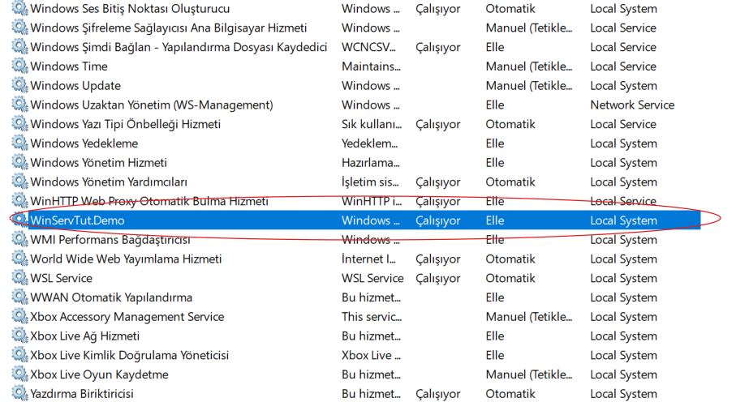
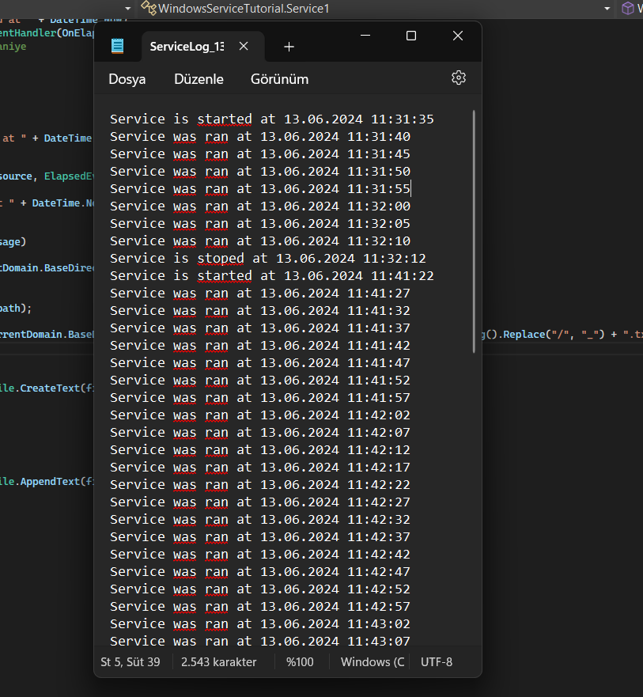

# Windows Service Tutorial

In this project, I created a Windows Service Tutorial. While working on the project, I used .NET version 4.7.2. This project helped me learn the basics of Windows services. Here are a few screenshots:


## Contributing

Contributions are welcome! Please open an issue or submit a pull request.



## Installation

To install the service, follow these steps:

1. Open `cmd` as an administrator.
2. Navigate to the .NET Framework directory:
    ```bash
    cd C:\Windows\Microsoft.NET\Framework\v4.0.30319
    ```
    (replace `v4.0.30319` with your version if different)
3. Run the following command:
    ```bash
    InstallUtil.exe C:\path\to\your\WindowsServiceTutorial\WindowsServiceTutorial\bin\Debug\WindowsServiceTutorial.exe
    ```

## Uninstallation

If you want to remove the Windows service, run the following command:
```bash
InstallUtil.exe -u C:\path\to\your\WindowsServiceTutorial\WindowsServiceTutorial\bin\Debug\WindowsServiceTutorial.exe
